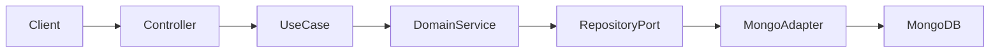
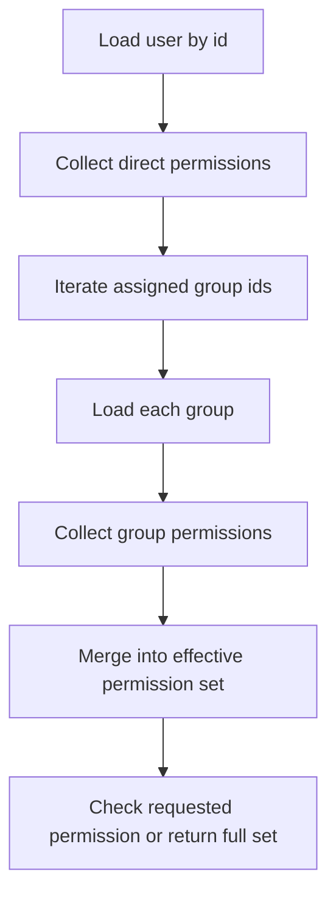
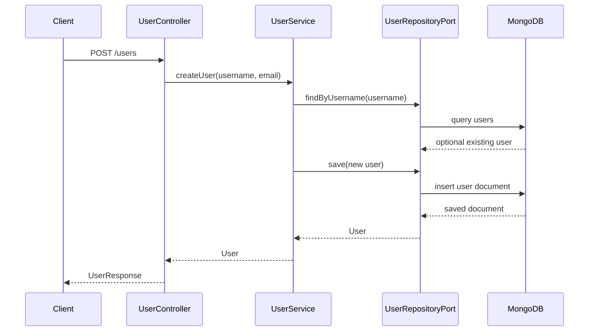
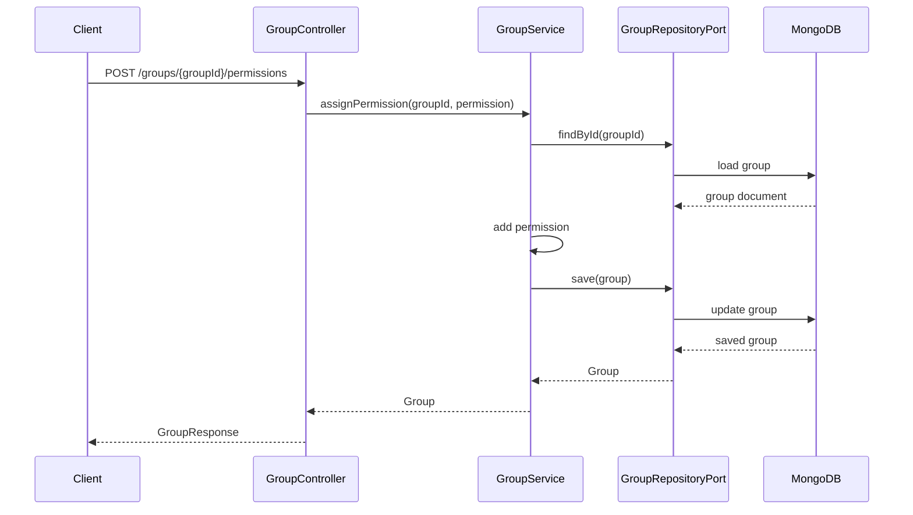
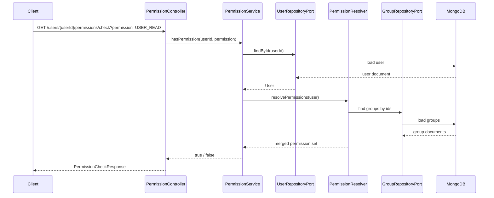

# Permission Service

A Spring Boot service for managing users, groups, and permission checks with MongoDB persistence.

## Overview

The service models a small permission domain:

- a `User` has an id, username, email, direct permissions, and assigned groups
- a `Group` has an id, name, description, and a set of permissions
- a user's effective permissions are the union of direct user permissions and permissions inherited from assigned groups

The project uses a port-and-adapter style structure:

- REST controllers expose the API
- use case interfaces define application capabilities
- domain services implement business rules
- repository adapters map domain objects to MongoDB documents

## Tech Stack

- Java 25
- Spring Boot 4
- Spring Web MVC
- Spring Data MongoDB
- Gradle
- JUnit 5 / Mockito
- Testcontainers

## Architecture

### Request Flow



### Permission Resolution Flow



## Exposed API

### Users

- `POST /users`
- `GET /users/{userId}`

### Groups

- `POST /groups`
- `GET /groups/{groupId}`
- `POST /groups/{groupId}/permissions`
- `DELETE /groups/{groupId}/permissions?permission=USER_READ`

### Permission Checks

- `GET /users/{userId}/permissions/check?permission=USER_READ`

## Example Workflows

### Create User



### Assign Group Permission



### Check Effective Permission



## Error Handling

Domain exceptions are converted to HTTP `ProblemDetail` responses.

TBD

## Local Development

### Prerequisites

- Java 25
- Docker

### Run MongoDB

```bash
docker compose -f ./docker/docker-compose.yml up
```

### Configure the application

`src/main/resources/application.yml`

### Start the service

```bash
./gradlew bootRun
```

## IntelliJ HTTP Examples

HTTP client examples are stored in [
`examples/permission-service.http`](/Users/jgoslar/projects/permissions-service/examples/permission-service.http).

Recommended usage in IntelliJ:

1. Start the application.
2. Open `examples/permission-service.http`.
3. Optionally select an environment from [
   `examples/http-client.env.json`](/Users/jgoslar/projects/permissions-service/examples/http-client.env.json).
4. Run requests directly from the gutter.

The example file includes:

- user creation
- user lookup
- group creation
- group lookup
- permission assignment
- permission removal
- permission check

## Manual Smoke Test

Create a user:

```bash
curl -H "Content-Type: application/json" \
  -d '{"username":"alice","email":"alice@example.com"}' \
  http://localhost:8080/users
```

Create a group:

```bash
curl -H "Content-Type: application/json" \
  -d '{"name":"admins","description":"Admin group"}' \
  http://localhost:8080/groups
```

Assign a permission to a group:

```bash
curl -H "Content-Type: application/json" \
  -d '{"permission":"USER_READ"}' \
  http://localhost:8080/groups/{groupId}/permissions
```

Check persisted documents:

```bash
docker exec -it permission-mongo mongosh
```

```javascript
use
permission_service
db.users.find().pretty()
db.groups.find().pretty()
```

## Testing Approach

The current test strategy is split into:

- domain unit tests for business logic
- controller tests for HTTP contracts
- persistence and integration tests for MongoDB-backed behavior

Testcontainers is the recommended option for database-backed tests to avoid a manually managed local MongoDB dependency
during automated test runs.
